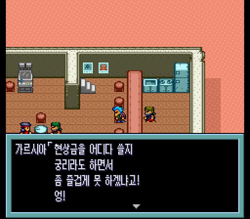

# 메탈맥스2 한글 패치 — 베타 1

슈퍼 패미컴용 「メタルマックス2」(Metal Max 2, 1993) 한국어 번역 패치입니다.
**베타판**이라 번역 검토가 다 끝나지 않았습니다 (아래 「베타 안내」).

> **피드백·버그 제보는 Discord 로**: **https://discord.gg/3qQ3drmwQV** (장소·인물·앞뒤 대사와 스크린샷을 함께 올려 주세요)

비공식 팬 번역입니다. 이 패치에는 게임 롬이 들어 있지 않으며, 원본 게임은 직접 준비해야 합니다.

## 내려받기

[Releases](https://github.com/beck4679-alt/MetalMax2-KR/releases) 에서 `MetalMax2_KR_beta1.zip` (패치 + 이 설명 + 글꼴 라이선스)

## 필요한 원본

| 항목 | 값 |
|---|---|
| 판본 | Metal Max 2 (Japan) |
| 크기 | 1,048,576바이트 (헤더 없음) |
| CRC32 | `9516BF39` |
| SHA-1 | `bd1ca8f771169cfff111046a79bcb297987e3bdc` |
| SHA-256 | `c5913db060f5f1156d167a09f6b1991ad0e4c21d3ea6abc6535661caf222c274` |

헤더(512바이트)가 붙은 `.smc` 파일(1,049,088바이트)은 앞 512바이트를 떼어 낸 뒤 적용하세요.

## 적용 방법

패치 파일 `MetalMax2_KR_beta1.xdelta`의 형식은 xdelta(VCDIFF)입니다.

- 웹: [Rom Patcher JS](https://www.marcrobledo.com/RomPatcher.js/) 에서 원본 롬과 패치를 고르고 적용
- Windows: xdelta UI · Delta Patcher 에서 원본 롬과 패치를 고르고 적용
- 명령줄: `xdelta3 -d -s 원본.sfc MetalMax2_KR_beta1.xdelta 메탈맥스2_한글.sfc`

적용 결과:

| 항목 | 값 |
|---|---|
| 크기 | 4,194,304바이트 (4MB) |
| CRC32 | `5F2D649F` |
| SHA-256 | `1339d087f438bee4c0a5a04a2ee42a5271d6a8b3a69245197cb63cc0f1beb9b7` |

원본이 다르면(헤더가 붙은 롬, 다른 판) 패치 안의 결과 체크섬이 맞지 않아 적용 도구가 멈춥니다.

패치 파일: 181,724바이트, SHA-256 `0128c5de33689fd56e13b3b5166bda73ef1af62bebcefa20ad4d86471ab672d7`

## 번역한 것

- 대사 전부, 메뉴·명령 버튼, 품목·무기·몬스터·장소·상태 이름, 대화 창 화자 이름, 동료·전차 기본 이름
- 이름 입력: 한글 조합 입력판 (완성형 2,350자)
- 그림으로 된 글자: 명령 버튼, 미니게임 판, 자판기 품절 표시, 8×8 작은 글자
- 그대로 둔 것: 타이틀 로고, 스태프 롤(영문), WANTED·JUKE BOX 같은 영문 표기

## 베타 안내 — 아직 확인이 끝나지 않은 것

- **대사**: 초벌 번역 뒤 독립 검토를 두 번 반영하고 기계 검사를 거쳤지만, 사람의 최종 검토는 아직입니다. 어색한 문장이나 오역이 남아 있을 수 있습니다.
- **처음부터 끝까지 실제로 플레이해 보지는 않았습니다.** 장면별 확인(마을·시설·상점·개조·전투·미니게임·엔딩)과 전체 자동 검사로 대신했습니다. 진행이 막히는 문제는 찾지 못했지만, 없다고 보장하지는 못합니다.
- 실제 게임 흐름으로 띄워 보지 못한 화면: 단말기의 다음 레벨 경험치 프로그램, 미니게임 「전차로 빵빵!」, 자판기 「품절」 표시 (그림과 글자는 따로 확인)
- 확인한 실행 환경: BizHawk 2.11.1 (BSNESv115+ 코어). 다른 에뮬레이터와 실기는 확인하지 않았습니다.

## 세이브

- 한글 이름을 저장하려고 세이브 메모리(SRAM)를 8KB에서 32KB로 늘렸습니다. 에뮬레이터는 롬 헤더를 보고 알아서 맞추지만, 실기(플래시 카트리지 등)에서는 32KB SRAM 이 필요합니다.
- 일본판 세이브를 불러오는 것은 확인하지 않았습니다. 새로 시작하세요.
- 다음 판에서도 세이브를 이어 쓸 수 있게 할 계획이지만, 보장하지는 않습니다.

## 오류 제보

오역·오타·어색한 문장·깨지는 화면을 발견하면 [Discord](https://discord.gg/3qQ3drmwQV) 나 [Issues](https://github.com/beck4679-alt/MetalMax2-KR/issues) 에 남겨 주세요.
화면 캡처와 장소(마을·인물), 앞뒤 대사를 함께 적어 주시면 찾기 쉽습니다.

## 글꼴

한글 글꼴은 갈무리(Galmuri, © Lee Minseo)입니다 — 대사·메뉴는 갈무리11 좁은꼴, 명령 버튼은 갈무리11 굵은꼴, 8×8 글자는 갈무리7.
SIL Open Font License 1.1 에 따라 쓰며, 라이선스 전문은 `LICENSE_Galmuri_OFL.txt` 에 있습니다.

## 변경 기록

- 베타 1 (2026-09-26): 첫 공개
